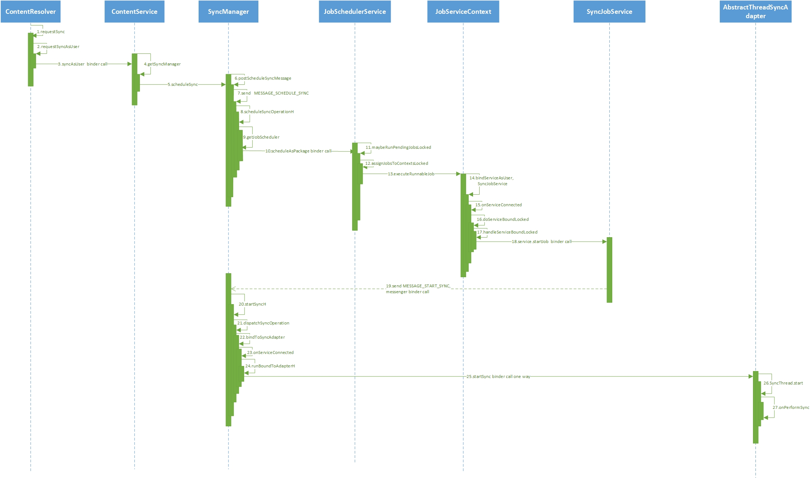
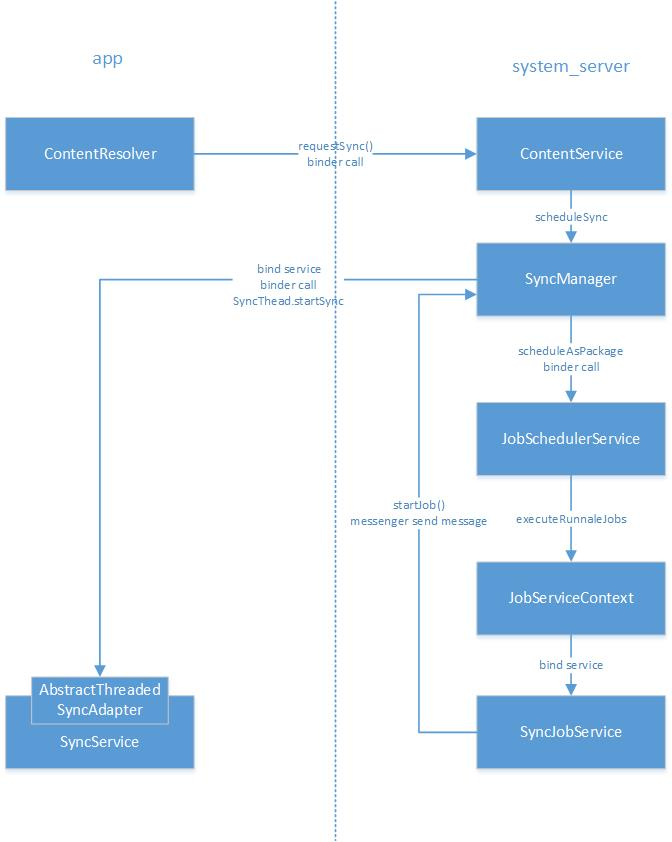

#### [Android's sync adapter framework](https://developer.android.com/training/sync-adapters/) helps manage and automate data transfers, and coordinates synchronization operations across different apps. When you use this framework, you can take advantage of several features that aren't available to data transfer schemes you design yourself.

The sample shows how to use syncAdapter and these following diagrams describe the process of invoke [ContentResolver.requestSync()](https://developer.android.com/reference/android/content/ContentResolver#requestSync(android.accounts.Account,%20java.lang.String,%20android.os.Bundle)) to trigger SyncAdapter framework sync data once.

- Sequence Diagram

- Flow Diagram

